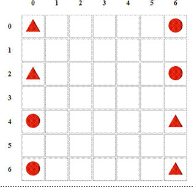
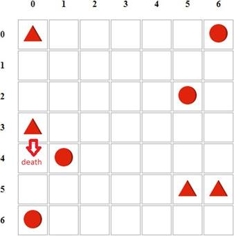
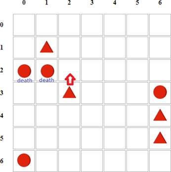
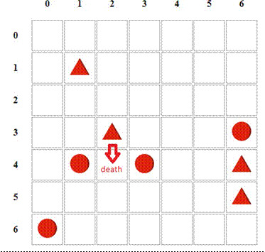
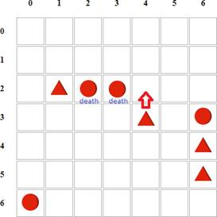
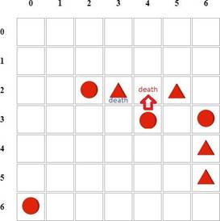

# Board Game Against AI

This is my Introduction to Artifical Intelligence term project. It is a simple board game against an AI player.
For creating AI, I used minimax algorithm with alpha - beta pruning and for GUI used pygame.
You can check the game rules below.

!Note that you need pygame for running the project. [text](https://www.pygame.org/wiki/GettingStarted)

1.	The Rules of the Game
The board size is 7*7.
Triangle symbols are the pieces of Player 1 which is the AI-based player. Circle symbols are the pieces of Player 2 which is the human player.
Every player has four pieces, and the game starts with the board configuration, as shown in Figure 1.
When the game starts, Player 1 moves first.

Figure 1: Initial board configuration. 

2.	The Rules of the Moves
The pieces can move in both horizontal and vertical directions. Diagonal moves are not allowed.
If the player has more than one piece, the player should make two subsequent moves with different pieces.
If the player has only one piece, the player should make only a single move.

3.	Capturing Pieces
If the player’s single piece or group of pieces are between the wall and the opponent piece, they are captured (Figure 2, Figure 3).

Figure 2: Capturing pieces.

If the player’s single piece or group of pieces are between two opponent pieces, it is captured (Figure 4, Figure 5).
If both player’s pieces are between two opponent pieces, all of these pieces are captured (Figure 6).
 

Figure 3: Capturing pieces.

Figure 4: Capturing pieces.
 

Figure 5. Capturing Pieces

Figure 6. Capturing Pieces

4.	Game End
When both players do not have any pieces: It is Draw. When both players have only a single piece: It is Draw.
When the player has some pieces, but the opponent player does not have any pieces: The player wins.
When the player has no pieces, but the opponent player has some pieces: The player losses.
After 50 moves in total:
If both players have same number of pieces: It is Draw. If the player has more pieces: The player wins.
Else: The player losses.
